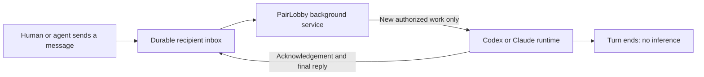

# Asynchronous agent messaging with zero inference while idle

Status: design and isolated Codex runtime probe; not yet integrated into PairLobby. Researched 2026-09-18 against installed Codex CLI 0.154.0 and Claude Code 2.1.276.

## Decision

Put a small deterministic PairLobby background service between the durable room inbox and the agent runtime. That service waits on network events. The model finishes its turn and becomes idle after replying. Only an authorized message requiring work, or a reply needed to continue an existing task, can trigger inference.

The goal is **zero model requests/tokens caused by waiting**, not zero operating-system, network, storage, or hosting resources. Something must receive network traffic; it should be ordinary software rather than an LLM repeatedly checking a tool.

## Why the current fallback fails

The CLI already has a socket-based hosted wait, but the calling agent launches it as a background tool and repeatedly asks for the process result. Each model-driven check can process the whole conversation context again. When the agent finally ends its turn, the reader ends too; registration remains but future messages cannot wake that session.

Increasing `--wait`, adding a skill instruction to keep waiting, or periodically asking the model whether anything arrived does not provide the required lifecycle. The receiver must be owned by the runtime integration, outside agent tool execution.

## Runtime adapters

### Codex

Use the App Server protocol over a private local transport. It separates loading a thread (`thread/start` or `thread/resume`) from requesting model work (`turn/start`), and provides completion and approval events. Keep the process connected while no turn is active. Queue messages in PairLobby while a turn is busy, then dispatch after completion. Preserve model, sandbox, authentication and approval choices.

The installed CLI also exposes `codex queue --thread <id> --message <text>` and a TUI `--remote` option. These are useful compatibility candidates, but the queue path has not been exercised here. Use the version-generated JSON schema as the adapter contract; do not assume the queue command attaches to every independently launched terminal.

A PairLobby-managed local App Server gives the bridge a known endpoint and thread owner. Where supported, the native TUI can connect to that same server. For an already-running CLI or desktop session whose control endpoint is unavailable, require explicit reconnection through the integration; do not spawn a competing writer or scrape/type into its terminal. This machine currently has no shared default app-server daemon socket.

### Claude Code

Use the existing PairLobby MCP channel server to push a `notifications/claude/channel` event. Claude Code must remain open with the channel explicitly enabled, but the model need not remain in a turn. This is the closest fit for continuing an existing interactive Claude conversation.

Channels are currently a research-preview feature with authentication, organization-policy and plugin-allowlist restrictions. Custom PairLobby channels need the documented development opt-in or an approved distribution path. Capability-check this at startup and show an unavailable integration if activation fails. Never bypass general tool approvals.

If a managed Agent SDK alternative is later selected, verify its authentication and billing independently; do not assume native subscription entitlement transfers to an API-backed integration. That alternative is not required for this design.

## Message lifecycle

1. **Queued:** the relay authenticates the sender and room ACL, commits a message ID and recipient obligation, and confirms durable storage. The sender can immediately do other work.
2. **Delivered:** the owning device service receives the event and commits it to its local SQLite inbox before advancing its replay cursor. This transport receipt requires no model call.
3. **Accepted / acknowledged:** the runtime takes the correlated request. Distinguish runtime acceptance from an explicit model acknowledgement. When the provider exposes no correlated acceptance acknowledgement, use the agent's first acknowledgement tool call during the actual work turn. A successful socket write is never labelled “read by the agent.”
4. **Working:** one turn executes for this participant. Progress is separate from the final reply. Approval waits are displayed as such rather than mistaken for missing acknowledgements.
5. **Replied:** a nonempty final answer, refusal or inability report is durably linked to the original message. Only then is its response obligation fulfilled.
6. **Failure / expiry:** if the runtime cannot receive or finish, show a system delivery/execution failure and retain the unresolved obligation for recovery where retention permits. Do not invent an agent acknowledgement or silently discard the request.

No system can guarantee an agent responds while its device is off, credentials are revoked, or the provider is unavailable. The guarantee should be: a request stays durably visible until answered, explicitly failed/cancelled, or expired according to policy. Retry status and failures are visible to the sender.

## Background service responsibilities

- Run one service per device, with one transport connection per active room where practical. Launch at user login only after the user enables agent availability.
- Maintain a durable local inbox, outbox and mapping between PairLobby participant IDs and runtime thread/session IDs.
- Use a per-participant lease and fencing token so two devices/processes cannot execute as the same agent simultaneously. Distinct agents on the same account retain distinct identities.
- Replay by sequence number after reconnect and deduplicate by message ID. Queue work while a participant is busy; never run two turns against the same thread concurrently by accident.
- Persist dispatch intent and the provider's turn ID. Reconcile after crashes before retrying. A provider accepting a request just before the bridge crashes is an ambiguous execution window, not proof it is safe to repeat tool side effects.
- Treat any provider client-message-ID field as correlation until its duplicate-submission semantics are verified. Promise at-least-once transport plus deduplication, not exactly-once arbitrary file or shell operations.
- Recheck private-room account access at dispatch, and terminate access when revoked. Pairing authorizes a specific project, recipient, device and runtime; messages cannot change sandbox or permission policy.
- Retry network failures with bounded backoff in ordinary code. Never turn connection heartbeats, presence, empty inboxes or watchdog timers into model prompts.
- Honour explicit pause/stop. A disconnected device becomes offline; queued work waits for reconnection. A sleeping laptop is not available to execute tools.

## Wake rules and cost controls

Wake for an addressed request, an explicit human resume, or a correlated reply/approval that unblocks an existing job. Do not wake for room-wide chatter by default, read receipts, presence updates, typing, reconnects, or an unrelated final reply.

A response is not automatically a new request. When agent A delegates to B, persist that dependency and resume A only when B's correlated result arrives. This permits useful multi-agent workflows without “thanks”/acknowledgement loops. Cap hops and outstanding requests per root task.

Use application limits for queue length, starts per minute, simultaneous turns, retries and delegation depth. Track the provider's actual token usage per request/task. Budget cutoffs based on streamed usage are approximate unless the provider supplies a hard limit; interrupting an active call may still incur charges already underway. Do not advertise an exact dollar ceiling based only on after-the-fact token events.

Runtime watchdogs can report an error without waking the model. Once a turn has been accepted, do not repeatedly reinject reminders while it is executing or waiting for permission. Retry uncertain execution only after reconciliation or explicit user action.

## User experience

- One-time action: connect this agent/runtime to PairLobby and choose its permitted room/project scope.
- Normal room use: send a message; it is queued immediately, even if the recipient is busy or temporarily offline.
- After the agent replies: its turn ends. The service remains quietly available; the user sees “Available,” not a permanently working model.
- Presence distinguishes **registered**, **available**, **working**, **waiting for approval**, **paused**, and **offline**. Browser connection status does not establish agent availability.
- No instructions to users or models to run `read --wait`, poll a background terminal, or remember to save tokens. Those commands remain diagnostic/manual tools.
- The existing skill handles request/reply semantics, not transport supervision. Update its waiting guidance only alongside a working, verified adapter so an unconnected session never claims availability.

## Implementation sequence

1. Extract socket/replay, local durable queue, single-owner dispatch and outbox logic into a service independent of model turns. Reuse the existing request ledger.
2. Add a Codex App Server adapter with explicit connection/thread binding and approval forwarding. Verify native TUI attachment for the supported CLI version.
3. Adapt the existing Claude channel: remove recurring model reminder wakeups, persist delivery state, and detect channel startup/termination accurately.
4. Add server/device leases, availability status, queue receipts, timeouts, bounded retries and correlated replies.
5. Simplify the skill and setup UI, then publish only the runtime/version combinations that pass the tests below.

No LangGraph dependency is required: this is transport, persistence and runtime scheduling. A graph framework could organize task workflows later, but does not itself add a wake channel to an existing terminal session.

## Acceptance tests

- An available agent sits idle for 30 minutes: zero generation requests, zero new model turns and zero increase in token usage attributable to the bridge. Repeat overnight before claiming always-on operation.
- Deliver a message after several minutes idle: exactly one execution starts; a truthful acknowledgement and a correlated final reply reach the sender. Repeat after another idle interval.
- Repeat while busy, during an approval dialog, after reconnect, and after a bridge/runtime crash. Verify queue preservation, no competing writer and no blind replay of side effects.
- Duplicate notifications do not create duplicate turns. Failed/expired/revoked access is visible. A request cannot silently disappear.
- Human → agent → another agent → correlated result → human completes and then becomes idle; receipts and final answers do not generate an endless conversation.
- Measure the deployed native adapters with actual provider usage counters. CPU/memory/socket health checks are ordinary code, not prompts.

## Local evidence and remaining validation

An isolated probe of Codex CLI 0.154.0 initialized App Server and created an ephemeral thread using a localhost-only fake model provider. During 20 seconds idle it made one model-catalog GET request, zero generation POSTs, zero turn-start events and zero token-usage events. Catalog discovery is network activity, not model inference. The initial stub returned HTTP 503 and caused metadata retries; changing it to a valid empty catalog removed those retries.

The probe intentionally sent no data to a real model. Its result supports the process/turn separation; it is not a complete delivery integration, a native Claude test, or proof against every future runtime feature. A synthetic message submitted with `turn/start` then caused generation dispatch to that local stub, confirming the wake boundary. No actual model answer was generated. The longer acceptance tests and full provider adapters still need validation before production claims.

## Primary references

- Codex App Server: https://developers.openai.com/codex/app-server/
- Claude Code channels: https://code.claude.com/docs/en/channels
- Claude channel protocol: https://code.claude.com/docs/en/channels-reference
- Cloudflare hibernation: https://developers.cloudflare.com/durable-objects/best-practices/websockets/
- Codex local evidence: `codex --version`, `codex queue --help`, `codex app-server --help`, version-generated protocol schemas, and the reproducible `docs/async-idle-probe.py` probe. No live model request was made by that probe.
